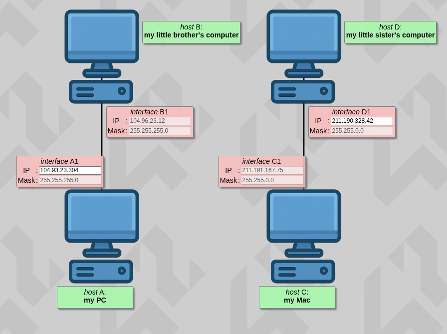
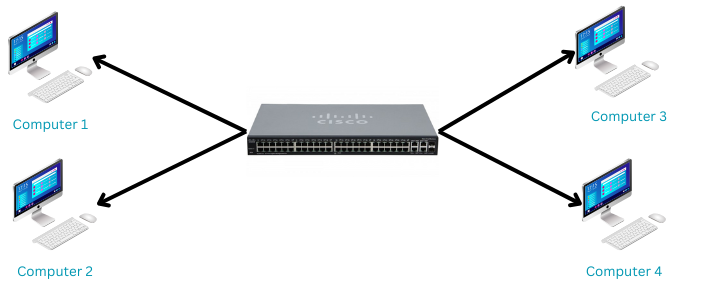

### *This project has been created as part of the 42 curriculum by aboumall*

# Description

The goal of this project is to configure configure small-scale networks and to understand tcp/ip adressesing as long as long as subnet mask and default geteway work.  

To do so we needed to complete 10 levels of small-scale networks that looks like this :

Then we need to download the json format for the correction.

# Instructions

This project doesn't contain any executable, the submission is the json files of the 10 levels and this README.md.

The peer-evaluation is done on the same website used to train the levels.

The training interface runs as so :

- First you open the index.html file from the project files
- Then you may enter your intranet login in "training" section and press "start" button
- Then for each level you have to modify the editable inputs so the networks works as the rules wants to
- When you are finished, you may press "Check again" to verify your work
- Finally when all is okay, you can press "Get my config" to download the json file that is expected

It's the same for the peer evaluation.

# Resources

## Network and TCP/IP

A network is a group of interconnected devices (such as computers, servers, and printers) that can communicate with each other and share data and resources using defined communication rules (protocols).

**TCP** and **IP** are core communication protocols used in computer networks.

### IP (Internet Protocol)

Is responsible for addressing and routing data packets so they can travel from a source device to a destination device across different networks.

### TCP (Transmission Control Protocol) 

It ensures reliable communication by establishing a connection, controlling data flow, checking for errors, and retransmitting lost packets to guarantee that data arrives correctly and in order.

### OSI layers

The OSI layers describe how data moves through a network by dividing communication into seven layers, from the physical transmission of data to user-level applications. Each layer has a specific role and helps in understanding, designing, and troubleshooting networks.

### IPv4 (Internet Protocol version 4)

Is a network protocol that uses 32-bit addresses to uniquely identify devices on a network. An IPv4 address is written in dotted decimal format (for example: 192.168.1.1) and is divided into a network part and a host part.

## Subnet Masks and CIDR

A **subnet mask** is used with an IPv4 address to identify the **network portion** and the **host portion** of the address. It allows a large network to be divided into smaller **subnets**, improving efficiency, performance, and security.

### CIDR Notation
**CIDR (Classless Inter-Domain Routing)** is a compact way to represent subnet masks using a slash followed by a number (e.g. `/24`).  
The number indicates how many bits are used for the network part.

Example:
- `192.168.1.0/24`
  - Network bits: 24
  - Host bits: 8
  - Total addresses: 256
  - Usable hosts: 254

### Examples
- `/24` → Subnet mask `255.255.255.0` → 254 usable hosts  
- `/26` → Subnet mask `255.255.255.192` → 62 usable hosts  
- `/30` → Subnet mask `255.255.255.252` → 2 usable hosts (often used for point-to-point links)

### CIDR Reference Table

| CIDR | Subnet Mask         | Total Addresses | Usable Hosts |
|-----:|--------------------|----------------|--------------|
| /0   | 0.0.0.0            | 4,294,967,296  | 4,294,967,294 |
| /1   | 128.0.0.0          | 2,147,483,648  | 2,147,483,646 |
| /2   | 192.0.0.0          | 1,073,741,824  | 1,073,741,822 |
| /3   | 224.0.0.0          | 536,870,912    | 536,870,910 |
| /4   | 240.0.0.0          | 268,435,456    | 268,435,454 |
| /5   | 248.0.0.0          | 134,217,728    | 134,217,726 |
| /6   | 252.0.0.0          | 67,108,864     | 67,108,862 |
| /7   | 254.0.0.0          | 33,554,432     | 33,554,430 |
| /8   | 255.0.0.0          | 16,777,216     | 16,777,214 |
| /9   | 255.128.0.0        | 8,388,608      | 8,388,606 |
| /10  | 255.192.0.0        | 4,194,304      | 4,194,302 |
| /11  | 255.224.0.0        | 2,097,152      | 2,097,150 |
| /12  | 255.240.0.0        | 1,048,576      | 1,048,574 |
| /13  | 255.248.0.0        | 524,288        | 524,286 |
| /14  | 255.252.0.0        | 262,144        | 262,142 |
| /15  | 255.254.0.0        | 131,072        | 131,070 |
| /16  | 255.255.0.0        | 65,536         | 65,534 |
| /17  | 255.255.128.0      | 32,768         | 32,766 |
| /18  | 255.255.192.0      | 16,384         | 16,382 |
| /19  | 255.255.224.0      | 8,192          | 8,190 |
| /20  | 255.255.240.0      | 4,096          | 4,094 |
| /21  | 255.255.248.0      | 2,048          | 2,046 |
| /22  | 255.255.252.0      | 1,024          | 1,022 |
| /23  | 255.255.254.0      | 512            | 510 |
| /24  | 255.255.255.0      | 256            | 254 |
| /25  | 255.255.255.128    | 128            | 126 |
| /26  | 255.255.255.192    | 64             | 62 |
| /27  | 255.255.255.224    | 32             | 30 |
| /28  | 255.255.255.240    | 16             | 14 |
| /29  | 255.255.255.248    | 8              | 6 |
| /30  | 255.255.255.252    | 4              | 2 |
| /31  | 255.255.255.254    | 2              | 0* |
| /32  | 255.255.255.255    | 1              | 1 |

\* `/31` is used for point-to-point links and has no traditional usable host addresses.

### Private IPv4 Addresses
Private IP addresses are reserved for **internal networks** and are **not routable on the Internet**.

| Class | Range |
|------|-------|
| Class A | 10.0.0.0 – 10.255.255.255 (`/8`) |
| Class B | 172.16.0.0 – 172.31.255.255 (`/12`) |
| Class C | 192.168.0.0 – 192.168.255.255 (`/16`) |

These addresses are commonly used in home, corporate, and lab networks and access the Internet through **NAT (Network Address Translation)**.

#### Other private Addresses :

  - **127.0.0.0** - 127.255.255.255, reserved for loopback and internal testing
  - **224.0.0.0** - 239.255.255.255, reserved for multicast
  - **240.0.0.0** - 255.255.255.255, reserved for experimental, used for research

## Switches and Routers

A **switch** is a network device used to connect multiple devices within the same **local area network (LAN)**. It operates mainly at **Layer 2 (Data Link)** of the OSI model and forwards data using **MAC addresses**. Switches reduce network collisions and improve performance by sending data only to the intended destination.

A **router** is a network device that connects **different networks** together and directs data between them. It operates at **Layer 3 (Network)** of the OSI model and uses **IP addresses** to determine the best path for data packets. Routers enable communication between a local network and external networks, such as the Internet, and often provide services like **NAT**, **DHCP**, and **firewalling**.

## Default Gateway

A **default gateway** is the device on a network that serves as an **access point to other networks**, typically a router. When a device wants to send data to an IP address outside its own subnet, it forwards the data to the default gateway, which then routes it toward the destination.

For example, in a home network, a computer with IP `192.168.1.10/24` might have a default gateway of `192.168.1.1` (the home router). Any traffic destined for the Internet goes through this gateway.

The default gateway is essential for enabling communication **between different networks** and for accessing external resources like the Internet.

## Ai usage

I used AI for this project in order to understand subnet masks and IP adressing, and also to help me read this README file.
